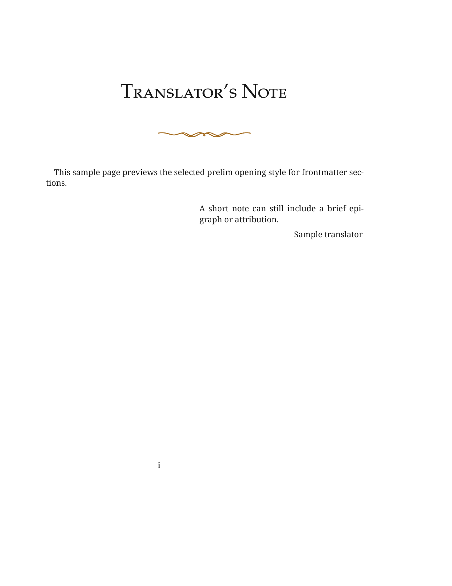
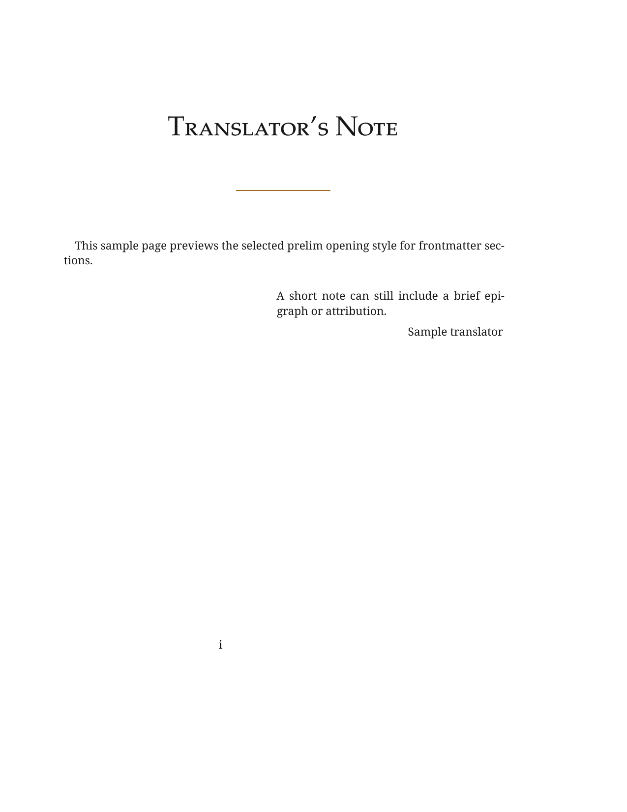
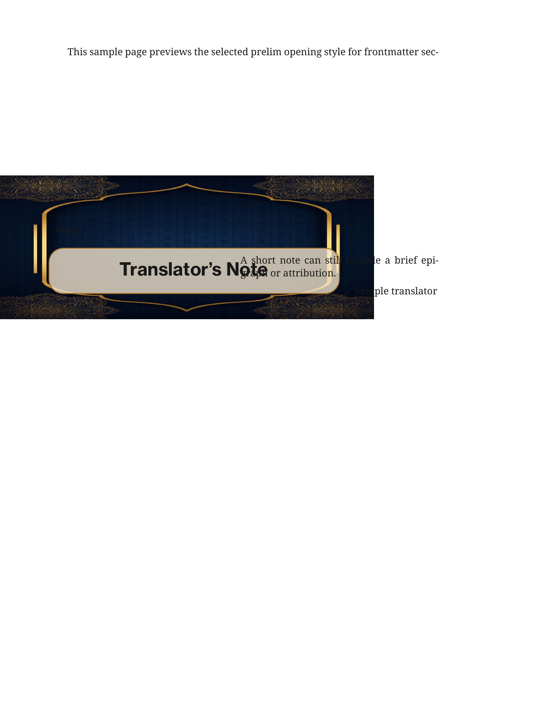

# XeLaTeX Book Template Repo

This repository is a XeLaTeX-first book template centered on [bookish.sty](./bookish.sty).
It provides:

- theme-based colors via [bookish-colors.sty](./bookish-colors.sty)
- swappable frontmatter/backmatter styles via [bookish-frontpage.sty](./bookish-frontpage.sty)
- a single metadata API through `\booksetup{...}`
- template-derived prelim section styles via [bookish-prelim.sty](./bookish-prelim.sty)

## Quick Start

The example entrypoint is [main.tex](./main.tex):

```latex
\documentclass[11pt,fleqn,oneside]{book}
\usepackage[
  theme=default,
  paper=a5,
  frontpage=star,
  backmatter=true,
  chapternumbering=roman,
  coverstyle=auto,
  runningheader=none,
  toc=true
]{bookish}

\booksetup{
  title={Explanation of Laamiyyah},
  subtitle={of Shaykhul-Islam Ibn Taymiyyah},
  subtitleposition={below},
  author={Zayd ibn Hadi Al-Madkhali},
  authoraddress={Shaykh Al-Allamah},
  translator={Abu Al-Abbas Moosaa Richardson},
  imprint={Salafi Press},
  publisherlogo={assets/images/publisher-white.png},
  publishstatus={review},
  backtext={Short back cover copy goes here.}
}
```

Then in the document body:

```latex
\frontmatter
\bookmaketitlepage
\booktableofcontents

\mainmatter
\chapter{Opening Chapter}
Text goes here.

\backmatter
\bookmakebackmatter
```

Optional prelim-section selection:

```latex
\customizeprelim{
  frontmatterstyle=curly,
  backmatterstyle=auto,
  frontmatterimage={assets/frontimages/feminine.jpg},
  backmatterimage={assets/frontimages/feminine.jpg}
}
```

## Package Options

`bookish.sty` supports:

- `theme=default|purple|black|sepia|ocean|forest|bluelight|cushion|embroid|emerald|feminine|goldenblue|greencutton|greenflower|petals|rose`
- `paper=6x9|a5|a4|letter`
- `frontpage=<see Frontpage Styles below>`
- `backmatter=true|false`
- `chapternumbering=roman|roman-lower|arabic`
- `coverstyle=auto|classic|band|frame`
- `runningheader=book|minimal|none`
- `toc=true|false`

## Metadata API

Use `\booksetup{...}` with:

- `title`
- `subtitle`
- `subtitleposition=above|below`
- `author`
- `authoraddress`
- `translator`
- `imprint`
- `publisherlogo`
- `publishstatus=demo|review|published`
- `year`
- `backtext`

Notes:

- `subtitle`, `authoraddress`, `translator`, `publisherlogo`, and `backtext` are optional.
- `publishstatus=published` hides the front-cover status tag.
- `year` is retained as metadata, but the current frontmatter system does not print it on the front cover.

## Frontpage Styles

Refresh these previews with:

- `scripts/generate-frontpage-samples.bat`
- `scripts/generate-frontpage-samples.sh`

<table>
  <tr>
    <td width="50%" align="center" valign="top" style="padding: 12px 14px 28px 14px;">
      
      <div style="margin-top: 6px; font-size: 1.08em; font-weight: 600;">star</div>
    </td>
    <td width="50%" align="center" valign="top" style="padding: 12px 14px 28px 14px;">
      
      <div style="margin-top: 6px; font-size: 1.08em; font-weight: 600;">flower</div>
    </td>
  </tr>
  <tr>
    <td width="50%" align="center" valign="top" style="padding: 12px 14px 28px 14px;">
      
      <div style="margin-top: 6px; font-size: 1.08em; font-weight: 600;">circle</div>
    </td>
    <td width="50%" align="center" valign="top" style="padding: 12px 14px 28px 14px;">
      
      <div style="margin-top: 6px; font-size: 1.08em; font-weight: 600;">bluelight</div>
    </td>
  </tr>
  <tr>
    <td width="50%" align="center" valign="top" style="padding: 12px 14px 28px 14px;">
      
      <div style="margin-top: 6px; font-size: 1.08em; font-weight: 600;">cushion</div>
    </td>
    <td width="50%" align="center" valign="top" style="padding: 12px 14px 28px 14px;">
      
      <div style="margin-top: 6px; font-size: 1.08em; font-weight: 600;">embroid</div>
    </td>
  </tr>
  <tr>
    <td width="50%" align="center" valign="top" style="padding: 12px 14px 28px 14px;">
      
      <div style="margin-top: 6px; font-size: 1.08em; font-weight: 600;">emerald</div>
    </td>
    <td width="50%" align="center" valign="top" style="padding: 12px 14px 28px 14px;">
      
      <div style="margin-top: 6px; font-size: 1.08em; font-weight: 600;">feminine</div>
    </td>
  </tr>
  <tr>
    <td width="50%" align="center" valign="top" style="padding: 12px 14px 28px 14px;">
      
      <div style="margin-top: 6px; font-size: 1.08em; font-weight: 600;">goldenblue</div>
    </td>
    <td width="50%" align="center" valign="top" style="padding: 12px 14px 28px 14px;">
      
      <div style="margin-top: 6px; font-size: 1.08em; font-weight: 600;">greencutton</div>
    </td>
  </tr>
  <tr>
    <td width="50%" align="center" valign="top" style="padding: 12px 14px 28px 14px;">
      
      <div style="margin-top: 6px; font-size: 1.08em; font-weight: 600;">greenflower</div>
    </td>
    <td width="50%" align="center" valign="top" style="padding: 12px 14px 28px 14px;">
      
      <div style="margin-top: 6px; font-size: 1.08em; font-weight: 600;">petals</div>
    </td>
  </tr>
  <tr>
    <td width="50%" align="center" valign="top" style="padding: 12px 14px 28px 14px;">
      
      <div style="margin-top: 6px; font-size: 1.08em; font-weight: 600;">rose</div>
    </td>
    <td width="50%"></td>
  </tr>
</table>

With `theme=default`, each frontpage uses its intended built-in design colors. If you set a different `theme`, it fully recolors `star`, `flower`, and `circle`, while the image-backed frontpages keep their image design and only the text styling is affected.

## Helper Commands

- `\bookmaketitlepage`
- `\booktableofcontents`
- `\bookmakebackmatter`
- `\bookfrontmattersection{...}`
- `\bookbackmattersection{...}`
- `\customizeprelim{...}`
- `\bookepigraph{quote}{attribution}`
- `\arabictext{...}`

The package also provides a `bookcallout` environment.

## Prelim Styles

The frontmatter/backmatter section openers now live in [bookish-prelim.sty](./bookish-prelim.sty).

Use `\customizeprelim{...}` with:

- `frontmatterstyle=curly|straight|sideblock|useimage|auto`
- `backmatterstyle=auto|curly|straight|sideblock|useimage`
- `image={...}` as a shared fallback image for `useimage`
- `frontmatterimage={...}` to override only frontmatter opener images
- `backmatterimage={...}` to override only backmatter opener images

Behavior:

- `frontmatterstyle` defaults to `curly`
- `frontmatterstyle=auto` also resolves to `curly`
- `backmatterstyle=auto` means "use the same style as `frontmatterstyle`"

If `useimage` is selected and no image is provided, the package falls back to
`assets/frontimages/emerald.jpg`.

Refresh these previews with:

- `scripts/generate-prelim-samples.bat`
- `scripts/generate-prelim-samples.sh`

<table>
  <tr>
    <td width="50%" align="center" valign="top" style="padding: 12px 14px 28px 14px;">
      
      <div style="margin-top: 6px; font-size: 1.08em; font-weight: 600;">curly</div>
    </td>
    <td width="50%" align="center" valign="top" style="padding: 12px 14px 28px 14px;">
      
      <div style="margin-top: 6px; font-size: 1.08em; font-weight: 600;">straight</div>
    </td>
  </tr>
  <tr>
    <td width="50%" align="center" valign="top" style="padding: 12px 14px 28px 14px;">
      
      <div style="margin-top: 6px; font-size: 1.08em; font-weight: 600;">sideblock</div>
    </td>
    <td width="50%" align="center" valign="top" style="padding: 12px 14px 28px 14px;">
      
      <div style="margin-top: 6px; font-size: 1.08em; font-weight: 600;">useimage</div>
    </td>
  </tr>
</table>

## Fonts

The package currently loads local fonts from [assets/fonts](./assets/fonts):

- `NotoSerif`
- `NeueHaasText`
- `Amiri`

XeLaTeX is required because the package depends on `fontspec` and local font loading.

## Project Structure

- [bookish.sty](./bookish.sty): main package and document-level options
- [bookish-colors.sty](./bookish-colors.sty): theme palette definitions
- [bookish-frontpage.sty](./bookish-frontpage.sty): frontmatter and backmatter renderers
- [bookish-prelim.sty](./bookish-prelim.sty): frontmatter/backmatter section opener renderers
- [main.tex](./main.tex): example entrypoint
- [scripts](./scripts): sample-generation scripts for frontpages and prelim styles
- [sample/frontpage](./sample/frontpage): generated frontpage preview PNGs
- [sample/prelim](./sample/prelim): generated prelim preview PNGs
- [src/content](./src/content): example chapter files
- [src/frontmatter](./src/frontmatter): example front/backmatter content
- [assets/fonts](./assets/fonts): bundled fonts
- [assets/images](./assets/images): image assets such as publisher logos
- [latex templates](./latex%20templates): reference material from the source template exploration

## Build

### Windows

```powershell
build.bat
```

### macOS / Linux

```bash
./build.sh
```

Both scripts:

- compile `main.tex` with XeLaTeX
- write the PDF to `build/main.pdf`
- clean common LaTeX byproducts from the repo root and `build/`
- prepend the repo root to `TEXINPUTS` so subdirectory TeX files can still resolve local `.sty` files

## Hooks

This repo is set up for Husky pre-commit hooks.

After cloning, run:

```bash
npm install
```

The pre-commit hook keeps generated previews in sync:

- changes to `bookish-frontpage.sty` regenerate and stage `sample/frontpage/`
- changes to `bookish-prelim.sty` regenerate and stage `sample/prelim/`

The sample generators compile each preview twice with XeLaTeX before converting it to PNG.
